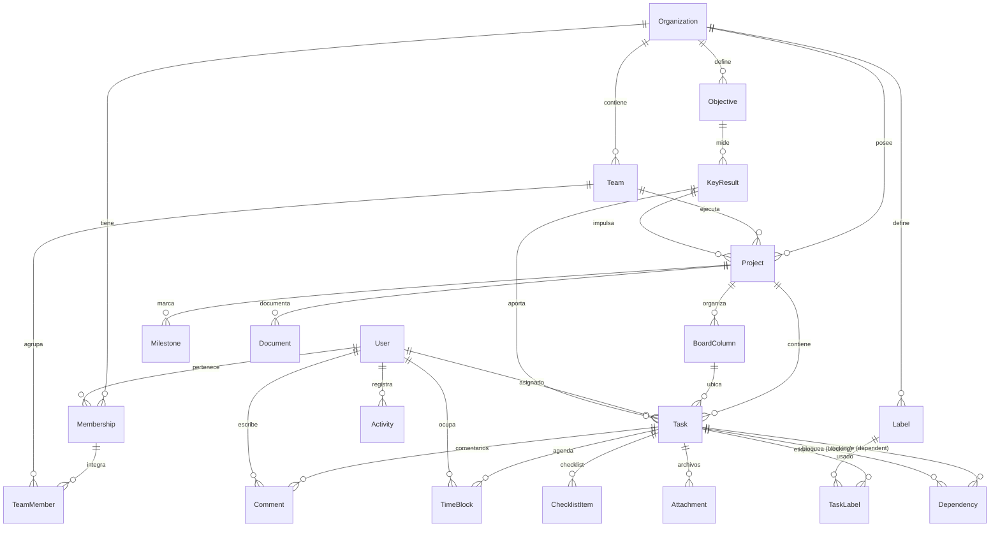

# 2 · Modelo de datos y Diagrama Entidad-Relación

Esquema completo en [prisma/schema.prisma](../prisma/schema.prisma). Aquí el ERD
y las decisiones de diseño.

## 2.1 ERD (Mermaid)

## 2.2 Decisiones clave

| Decisión | Por qué |
|----------|---------|
| `Task.order` como `Float` | Reordenamiento drag&drop O(1): nuevo orden = (prev+next)/2, sin reindexar la columna. Rebalanceo perezoso cuando la distancia < epsilon. |
| Inputs de prioridad en la tabla `Task` (`impact`, `urgency`…) | El score se recalcula con función pura; guardar inputs permite re-puntuar si cambian los pesos de la org sin perder datos. |
| `Dependency` como tabla con `type` | Soporta los 4 tipos de Jira (FS/SS/FF/SF), no solo bloqueo simple. Índice por `blockingId` para "¿qué desbloqueo al terminar?". |
| `TimeBlock` separado de `Task` | Una tarea de 8h → varios bloques de 2h en distintos días. `source=AUTO/MANUAL` distingue lo generado del motor de lo fijado por el usuario. |
| `Document.content` como `Json` | Editor estilo Notion (BlockNote/Tiptap) serializa árbol de bloques; flexible sin migraciones por cada tipo de bloque. |
| `OrgRole` + scopes finos en CASL | El enum da el rol base; CASL refina por proyecto/recurso. Ver [04-RBAC.md](04-RBAC.md). |
| Soft-delete (`deletedAt`) en Organization/Project/Task | Papelera de 30 días + cumplimiento (no perder historial al instante). |
| `pgvector` (no en schema Prisma, vía SQL raw) | Embeddings de docs/tareas para el RAG del asistente IA. |

## 2.3 Índices críticos para rendimiento

- `Task(projectId, status)` — board y filtros por columna.
- `Task(assigneeId)` + `TimeBlock(userId, start)` — cálculo de capacidad y agenda.
- `Task(priorityScore)` — vista "qué hacer hoy".
- `Dependency(blockingId)` — propagación de desbloqueos.
- `Project(organizationId, status)` — dashboard ejecutivo.

## 2.4 Particionado futuro (escala)

- `Activity` y `Notification` crecen sin límite → particionado por rango de
  fecha (`createdAt`) mensual + retención.
- `TimeBlock` → índice BRIN por `start` cuando supere ~50M filas.
